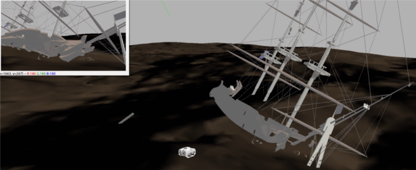

# BlueRov-ROS-playground
Scripts to help BlueRov integration with ROS.
What is possible ?
- Video streaming capture with opencv
- Read and write over mavlink protocol with MAVROS
- Joystick interaction
- Gazebo simulation

  

## Getting Started

### Requirements ###
- git
- [ROS Noetic Desktop Full](http://wiki.ros.org/noetic/Installation/Ubuntu) (Tested on Noetic, might work on newer versions)
- [mavros](http://wiki.ros.org/mavros) (`sudo apt-get install ros-noetic-mavros ros-noetic-mavros-extras`)
- Python 3 (`python3-dev`)
- Python Packages:
  - `pip install opencv-python numpy PyYAML pymavlink`
- GStreamer & Python Bindings (for video and `video.py` / `bluerov2_node`):
  - `sudo apt-get update`
  - `sudo apt-get install python3-gi python3-gst-1.0 gir1.2-gst-plugins-base-1.0 gstreamer1.0-plugins-good gstreamer1.0-plugins-ugly gstreamer1.0-plugins-bad gstreamer1.0-libav`
- (Optional for Gazebo Simulation) [freefloating_gazebo](https://github.com/freefloating-gazebo/freefloating_gazebo)

### Installation ###
 1. Go to your ROS package source directory:
    - `$ cd ros_workspace_path/src`
 2. Clone this project.
    - `$ git clone https://github.com/patrickelectric/bluerov_ros_playground`
 3. Go back to your ROS workspace:
    - `$ cd ../`
 4. Build and install it:
    - `$ catkin build bluerov_ros_playground` (Recommended) or `$ catkin_make --pkg bluerov_ros_playground`
 5. Reload your ROS env in every new terminal before running nodes:
    - `$ source devel/setup.bash` (if using bash)
    - `$ source devel/setup.zsh` (if using zsh)

## Running ##

### BlueRov2 MAVLink Bridge Node (`bluerov2_node.launch`) ###

This node acts as a bridge between the BlueROV2 (via MAVLink over UDP) and ROS. It subscribes to ROS topics to send commands (RC overrides, mode changes, servo PWM) to the ROV and publishes ROV data (IMU, odometry, battery, state, camera stream) onto ROS topics.

**Prerequisites:**
- Ensure all dependencies listed under "Requirements" are installed.
- Make sure the BlueROV2 is powered on and connected to the network.
- The BlueROV2 companion computer should be configured to send MAVLink UDP packets to the computer running this ROS node on port 14550.

**How to Run:**
1. Source your workspace setup file: `source devel/setup.bash`
2. Launch the node: `roslaunch bluerov_ros_playground bluerov2_node.launch`

**Configuration:**
- The launch file uses the argument `bluerov_node_device` to specify the MAVLink connection string.
- The default value is `udpin:0.0.0.0:14550`, which means the node will listen for incoming UDP packets on port 14550 on all network interfaces of the computer running the node.

### Launch User Example (`user_mav.launch`) ###

    This example will start user example, reading data from mavlink, interacting with joystick over rc commands and showing ROV video stream.
    - `roslaunch bluerov_ros_playground user_mav.launch`

    To run QGC parallel with user_mav, it's necessary to run user_mav first. If it's necessary to change the input, the parameter `joy_dev` can be used to set the one used.

- Visualize video stream

    Shows video stream using opencv and gstreamer
    - `roslaunch bluerov_ros_playground video.launch`

    To capture video stream in user_mav/video and QGC at same time, it's necessary to modifie [gstreamer options](http://192.168.2.2:2770/camera), changing `! udpsink host=192.168.2.1 port=5600` to `! multiudpsink clients=192.168.2.1:5600,192.168.2.1:5601` and add the udp_port parameter when calling roslaunch (`video_udp_port:=5601`).

- Gazebo

    This example allow SITL communication with Gazebo, right now the only interaction that happen is the thruster control using [thruster pwm fitting](https://colab.research.google.com/notebook#fileId=1CEDW9ONTJ8Aik-HVsqck8Y_EcHYLg0zK).
    - Run SITL and start gazebo.launch
    - `roslaunch bluerov_ros_playground gazebo.launch`

- Gazebo Teleop

    It'll open a window with the camera stream and Gazebo, a joystick can be used to control the ROV.
    - `roslaunch bluerov_ros_playground gazebo_teleop.launch`

    To change the default joystick input (`/dev/input/js0`), it's possible add the parameter `joy_dev:=/dev/input/jsX` when launching the simulation.

- RVIZ

    Visualize 3D model
    - `roslaunch bluerov_ros_playground rviz.launch`

### Running with SITL ###
- Run ArduPilot SITL

    1. [Download ArduPilot and configure SITL](http://ardupilot.org/dev/docs/setting-up-sitl-on-linux.html).
    2. `$ cd ardupilot/ArsuSub`
    3. `$ sim_vehicle.py`

    - To test mavros communication with SITL:
        - `$ roslaunch mavros apm.launch fcu_url:=udp://0.0.0.0:14550@`

- Fake video stream

    - `$ gst-launch-1.0 videotestsrc ! video/x-raw,width=640,height=480 ! videoconvert ! x264enc ! rtph264pay ! udpsink host=127.0.0.1 port=5600`
        - If necessary, change video source and resolution.
        - To test the udp reception: `gst-launch-1.0 -v udpsrc port=5600 ! application/x-rtp, payload=96 ! rtpjitterbuffer ! rtph264depay ! avdec_h264 ! fpsdisplaysink sync=false text-overlay=false`

## Topics ##
If you need more information about the topics and what you can access, take a look [here](doc/topics_and_data.md).

## Software Layer Diagram ##

<pre>
                      +-----------------------+         +------------------------+
                      |     <b>Raspberry Pi</b>      |         |    <b>Topside Commputer</b>   |
                      |    <b>ip 192.168.2.2</b>     |         |     <b>ip 192.168.2.1</b>     |
                      |                       |         |                        |
+-------+  Telemetry  | +-------------------+ |         |                        |
|Pixhawk<-------------->USB         <b>MAVProxy</b>| |         |                        |
+-------+    Pilot    | +                   + |         | +--------------------+ |
            Control   | |            udpbcast<----------->:14550         <b>MAVROS</b>| |
                      | +-------------------+ |  Pilot  | |(UDP)               | |
                      |                       | Control | |                    | |
                      | +-------------------+ |         | |       (ROS)        | |
+---------+           | CSI+2       <b>raspivid</b>| |         | +------+/mavros+-----+ |
|Raspberry+------------>camera              | |         |           ^            |
| Camera  |           | port                | |         |           |            |
+---------+           | +                   | |         | +---------v----------+ |
                      | |                   | |         | |subs.py      pubs.py| |
                      | +------------+stdout+ |         | |                    | |
                      |                  +    |         | |                    | |
                      |             Raw  |    |         | |                    | |
                      |             H264 |    |         | |                    | |
                      |                  v    |         | |      <b>user.py</b>       | |
                      | +------------+ fdsrc+ |         | |                    | |
                      | |<b>gstreamer</b>          | |         | |                    | |
                      | |                   + |         | :5600 video.py       | |
                      | |             udpsink+----------->(UDP)                | |
                      | +-------------------+ |  Video  | +---------^----------+ |
                      |                       | Stream  |           |            |
                      +-----------------------+         |           +            |
                                                        | +--------/joy--------+ |
                                                        | |<b>joy</b>     (ROS)       | |         +--------+
                                                        | |                  USB<----------+Joystick|
                                                        | +--------------------+ |  Pilot  +--------+
                                                        |                        | Control
                                                        +------------------------+
</pre>
